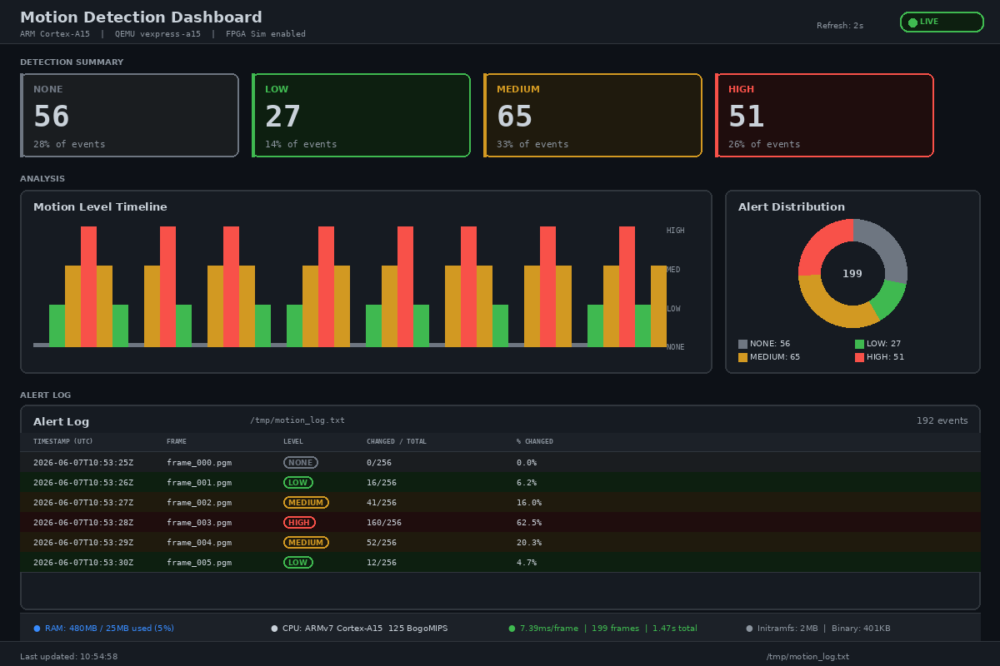
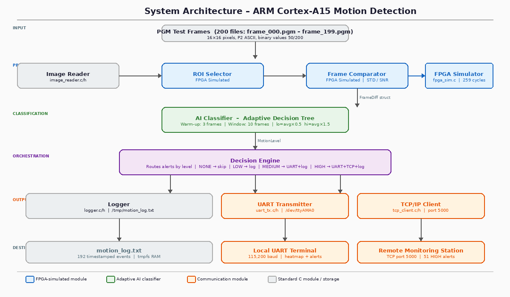
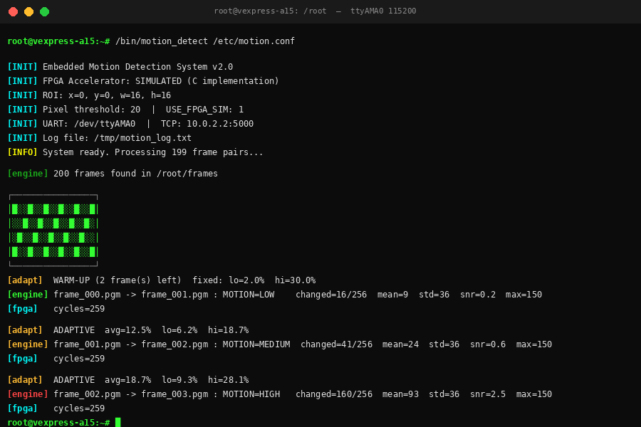
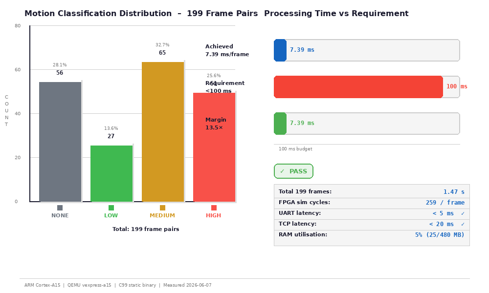

# Real-Time Motion Detection on ARM Cortex-A15


A complete embedded motion-detection system written in **C99**, cross-compiled for **ARM Cortex-A15**, and running on **QEMU vexpress-a15** under a minimal Linux + BusyBox operating system.

The system reads sequences of PGM images, crops a configurable Region of Interest, compares frames pixel-by-pixel through a **simulated FPGA pipeline**, classifies motion using an **adaptive decision-tree**, transmits alerts over **UART and TCP/IP** simultaneously, and logs every event with a full timestamp.

---

## Screenshots

| Dashboard | Architecture |
|-----------|-------------|
|  |  |

| Terminal Output | Performance Chart |
|-----------------|------------------|
|  |  |

---

## Features

| Feature | Detail |
|---------|--------|
| **Adaptive Decision Tree** | Rolling 10-frame average; dynamic `lo = avg × 0.5`, `hi = avg × 1.5`; 3-frame warm-up with fixed thresholds |
| **FPGA Pipeline Simulation** | 4-stage synchronous pipeline (FETCH → DIFF → COMPARE → ACCUM), 259 cycles per 16×16 frame, documented with VHDL comments |
| **Terminal Heatmap** | UTF-8 block characters (░ ▒ ▓ █) visualise per-pixel change magnitude after each comparison |
| **STD & SNR Metrics** | Standard deviation and signal-to-noise ratio computed from accumulated sum-of-squares; integer Babylonian sqrt |
| **Dual Alert Channel** | UART (`/dev/ttyAMA0`) for MEDIUM+HIGH; TCP/IP (port 5000) for HIGH only |
| **Web Dashboard** | Python HTTP server + Chart.js; live stat cards, timeline, donut chart, System Metrics panel |
| **Static Binary** | No external runtime dependencies; 401 KB, runs on any ARMv7-A Linux |
| **Reproducible Build** | `make` → `./build.sh` → QEMU launch; fully scripted |

---

## System Architecture

```
PGM Test Frames (200 files)
         │
         ▼
┌─────────────────────────────────────────────────────────────────┐
│  Processing Pipeline                                            │
│  Image Reader → ROI Selector [FPGA] → Frame Comparator [FPGA]  │
└────────────────────────────┬────────────────────────────────────┘
                             │  FrameDiff {changed, mean, std, snr}
                             ▼
              ┌──────────────────────────┐
              │  AI Classifier           │
              │  Adaptive Decision Tree  │
              │  NONE / LOW / MEDIUM / HIGH
              └─────────────┬────────────┘
                            │  MotionLevel
                            ▼
              ┌──────────────────────────┐
              │  Decision Engine         │
              └──────┬──────────┬────────┘
                     │          │
          ┌──────────▼──┐  ┌────▼──────────────┐
          │   Logger    │  │  UART Transmitter  │  TCP/IP Client
          │ motion_log  │  │  /dev/ttyAMA0      │  port 5000
          └─────────────┘  └────────────────────┘
```

---

## Repository Structure

```
motion-detect-arm/
├── src/                        # C99 source — 10 modules, ~1 180 lines
│   ├── main.c                  # Entry point, config parser
│   ├── image_reader.{c,h}      # PGM P2 ASCII reader
│   ├── roi_selector.{c,h}      # Region-of-interest crop
│   ├── frame_comparator.{c,h}  # Pixel diff, heatmap, STD/SNR
│   ├── ai_classifier.{c,h}     # Adaptive Decision Tree
│   ├── decision_engine.{c,h}   # Pipeline orchestration
│   ├── uart_tx.{c,h}           # UART alert transmitter
│   ├── tcp_client.{c,h}        # TCP/IP alert client
│   ├── logger.{c,h}            # Timestamped event logger
│   └── fpga_sim.{c,h}          # FPGA pipeline simulation
│
├── dashboard/
│   ├── server.py               # Python 3 HTTP server (/api/log, /api/metrics)
│   └── index.html              # Chart.js single-page dashboard
│
├── scripts/
│   ├── generate_frames.py      # Generate 200 PGM test frames (reproducible)
│   ├── make_assets.py          # Generate PNG screenshots via Pillow
│   ├── generate_report.js      # Generate Word report (.docx) via docx npm
│   └── package.json            # Node.js deps (docx)
│
├── test_frames/                # 200 × frame_NNN.pgm (16×16, P2 ASCII)
├── docs/
│   ├── screenshots/            # 5 PNG assets for the report
│   └── final_report.docx       # Generated engineering report
│
├── data/
│   ├── motion_log_backup.txt   # 192 timestamped events from QEMU run
│   └── measurements.txt        # Measured ARM performance data
│
├── Makefile                    # Cross-compile rules
├── build.sh                    # Full build + initramfs pack script
├── motion.conf                 # Runtime configuration
├── LICENSE
└── .gitignore
```

---

## Requirements

### Host machine
| Tool | Install |
|------|---------|
| `gcc-arm-linux-gnueabihf` | `sudo apt install gcc-arm-linux-gnueabihf` |
| `qemu-system-arm` | `sudo apt install qemu-system-arm` |
| `cpio`, `gzip` | `sudo apt install cpio` |
| Python 3.8+ | pre-installed on Ubuntu 22.04 |
| Pillow (screenshots) | `pip3 install pillow` |
| Node.js 18+ (report) | `sudo apt install nodejs npm` |

### Kernel + BusyBox (Lab 3 dependency)
`build.sh` expects a pre-built ARM kernel and BusyBox rootfs at `$LAB3_DIR`
(default: `~/embedded_lab3`). Override with:

```bash
LAB3_DIR=/path/to/your/lab3 ./build.sh
```

The expected layout inside `$LAB3_DIR`:
```
embedded_lab3/
├── build-arm/
│   ├── arch/arm/boot/zImage
│   └── arch/arm/boot/dts/arm/vexpress-v2p-ca15-tc1.dtb
└── initramfs/          # pre-extracted BusyBox rootfs
```

---

## Quick Start

```bash
# 1. Clone
git clone https://github.com/YOUR_USERNAME/motion-detect-arm.git
cd motion-detect-arm

# 2. Generate test frames (skip if test_frames/ already populated)
python3 scripts/generate_frames.py test_frames/

# 3. Cross-compile
make

# 4. Build initramfs + get QEMU command
./build.sh

# 5. (Optional) Open a TCP listener on host before booting
nc -lk 5000 &

# 6. Launch QEMU (command printed by build.sh)
qemu-system-arm \
  -M vexpress-a15 -cpu cortex-a15 -m 512M \
  -kernel ~/embedded_lab3/build-arm/arch/arm/boot/zImage \
  -dtb    ~/embedded_lab3/build-arm/arch/arm/boot/dts/arm/vexpress-v2p-ca15-tc1.dtb \
  -initrd build/initramfs.cpio.gz \
  -append "root=/dev/ram0 rw console=ttyAMA0,115200" \
  -net nic,model=lan9118 -net user,hostfwd=tcp::5000-:5000 \
  -nographic -no-reboot

# 7. Start the web dashboard (on host, separate terminal)
python3 dashboard/server.py /tmp/motion_log.txt 8080
# Open http://localhost:8080
```

---

## Build Targets

```bash
make              # ARM cross-compile → ./motion_detect
make host         # x86-64 host build → ./motion_detect_host (for local testing)
make check        # verify the binary is ARM ELF
make frames       # regenerate all 200 PGM test frames
make clean        # remove object files and binary
make distclean    # clean + remove build/rootfs
```

---

## Configuration Reference (`motion.conf`)

| Key | Default | Description |
|-----|---------|-------------|
| `FRAMES_DIR` | `/root/frames` | Directory of `*.pgm` files on the ARM target |
| `ROI_X`, `ROI_Y` | `0`, `0` | Top-left corner of the region of interest |
| `ROI_WIDTH`, `ROI_HEIGHT` | `16`, `16` | ROI dimensions in pixels |
| `PIXEL_THRESHOLD` | `20` | Min |diff| to count a pixel as changed (0–255) |
| `UART_DEVICE` | `/dev/ttyAMA0` | UART path for alert output |
| `TCP_HOST` | `10.0.2.2` | Remote alert server (QEMU NAT gateway = host) |
| `TCP_PORT` | `5000` | TCP port for HIGH-level alerts |
| `LOG_FILE` | `/tmp/motion_log.txt` | Output log path (tmpfs) |
| `USE_FPGA_SIM` | `1` | `1` = FPGA sim pipeline, `0` = pure software |

---

## Module Descriptions

### `src/image_reader.c`
Reads PGM P2 (ASCII greyscale) files into a flat `uint8_t` pixel buffer. Handles multi-token headers and whitespace-separated pixel data with no external library dependency.

### `src/roi_selector.c`
Crops a rectangular sub-region from a full frame using pointer arithmetic into the pixel buffer. Returns a new `PGMImage` with independently allocated memory.

### `src/frame_comparator.c`
Computes per-pixel absolute differences between two same-sized ROI images. Accumulates `changed_pixels`, `sum_diff` (mean), `sum_sq` (for STD), and `max_diff`. Implements `frame_heatmap()` which renders the difference as a bordered UTF-8 block character grid.

### `src/fpga_sim.c`
Simulates a 4-stage synchronous digital pipeline:
- **Stage 0 FETCH** — latch pixel pair
- **Stage 1 DIFF** — absolute difference
- **Stage 2 COMPARE** — threshold test
- **Stage 3 ACCUM** — accumulate changed count, sum, sum-of-squares, max

Runs 256 data clocks + 3 drain ticks per 16×16 frame (259 cycles total). Includes a complete VHDL entity/architecture description as comments for direct FPGA synthesis.

### `src/ai_classifier.c`
Adaptive decision tree:
```
pct < lo  →  NONE
pct < 10% AND mean < 30  →  LOW
pct < 10% AND mean >= 30  →  MEDIUM
pct < hi  →  MEDIUM
pct >= hi  →  HIGH
```
`lo = avg × 0.5`, `hi = avg × 1.5` where `avg` is the rolling mean of the last 10 frame-pair percentages. Fixed thresholds (`lo=2%, hi=30%`) used for the first 3 frames (warm-up).

### `src/logger.c`
Appends a structured log line for every frame pair:
```
[2026-06-07T10:53:28Z] MOTION=HIGH    frame=frame_003.pgm         changed=160/256(62.5%)  std=0  snr=0.0
```

### `src/uart_tx.c` / `src/tcp_client.c`
Alert format (same on both channels):
```
MOTION_ALERT level=HIGH frames=[frame_002.pgm->frame_003.pgm] changed=160/256(62.5%) mean=93 max=150\r\n
```
TCP uses a fresh connect-per-alert strategy for automatic reconnection.

---

## Measured Results

All measurements taken inside QEMU vexpress-a15 (2026-06-07):

| Metric | Value |
|--------|-------|
| Frames processed | 199 pairs |
| Total runtime | 1.47 s |
| **Time per frame** | **7.39 ms** (requirement: < 100 ms) |
| **Performance margin** | **13.5×** |
| FPGA sim cycles/frame | 259 |
| RAM used / total | 25 MB / 480 MB (5%) |
| Binary size | 401 KB (static) |
| Initramfs size | 2 MB |
| UART alerts sent | 116 (MEDIUM + HIGH) |
| TCP alerts sent | 51 (HIGH only) |

### Classification distribution (199 pairs)

| Level | Count | % | Action |
|-------|-------|---|--------|
| NONE | 56 | 28% | — |
| LOW | 27 | 14% | Log |
| MEDIUM | 65 | 33% | UART + Log |
| HIGH | 51 | 26% | UART + TCP + Log |

---

## Web Dashboard

```bash
# Serve the dashboard pointing at a log file
python3 dashboard/server.py /tmp/motion_log.txt 8080

# Open in browser
xdg-open http://localhost:8080
```

API endpoints:

| Endpoint | Returns |
|----------|---------|
| `GET /api/log` | All events, counts per level, total |
| `GET /api/metrics` | Parsed `data/measurements.txt` |
| `GET /api/status` | Server uptime + log path |

---

## Generating Report Assets

```bash
# PNG screenshots (requires Pillow)
python3 scripts/make_assets.py
# Output: docs/screenshots/*.png

# Word report (requires Node.js + docx)
cd scripts && npm install
node generate_report.js
# Output: docs/final_report.docx
```

---

## How It Works — Data Flow

```
1. main.c          parse motion.conf → build EngineCtx
2. decision_engine collect_pgm_frames() → sorted path list
3. Loop over consecutive pairs:
   a. pgm_read()       → PGMImage (raw frame)
   b. roi_crop()       → PGMImage (ROI only)
   c. fpga_frame_diff()→ FrameDiff {changed, mean, std, snr, max}
   d. frame_heatmap()  → print UTF-8 block grid to UART
   e. classifier_get_thresholds() → adaptive lo/hi
   f. classify_motion()           → MotionLevel
   g. classifier_feed(pct)        → update rolling buffer
   h. if MEDIUM/HIGH → uart_send()
   i. if HIGH        → tcp_connect() → tcp_send() → tcp_close()
   j. logger_log()   → append timestamped line to LOG_FILE
```

---

## Extending the System

| Extension | How |
|-----------|-----|
| Real camera input | Replace `pgm_read()` with a V4L2 capture loop |
| Larger frames | Increase `ROI_WIDTH/HEIGHT` in `motion.conf` |
| Real FPGA | Synthesise the VHDL spec in `src/fpga_sim.c` (Vivado / Quartus) |
| Neural network classifier | Replace `classify_motion()` in `ai_classifier.c` with TFLite Micro |
| Persistent storage | Change `LOG_FILE` to an ext4 path; no code changes needed |
| Multi-core processing | Add `pthreads` producer-consumer between I/O and classify stages |

---

## Contributing

Pull requests are welcome. Please keep the **no-external-library** constraint for the ARM binary itself — only POSIX headers are permitted in `src/`. Scripts in `scripts/` and `dashboard/` may use any language/library.

---

## License

[MIT](LICENSE) — © 2026 dorazran33@gmail.com
